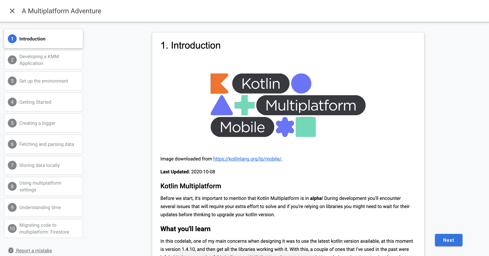
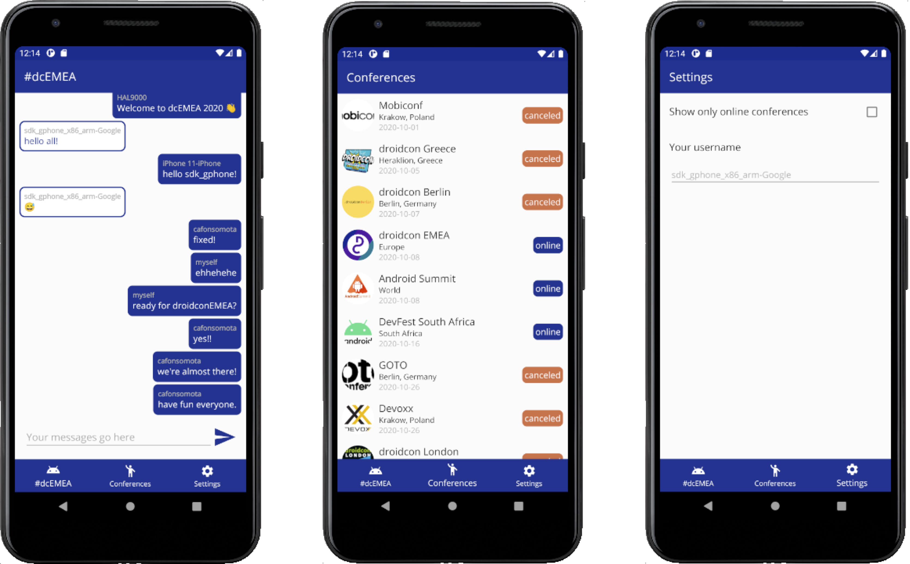

# A Multiplatform Adventure

Kotlin Multiplatform is here! 🙌

I've created a codelab where you can follow step by step the development of android and iOS application using Kotlin Multiplatform:

👉 [Codelab](https://cmota.github.io/kmp-codelabs/)

👉 [Source Code](https://github.com/cmota/kmm-a-multiplatform-adventure)

👉 [Presentation](https://speakerdeck.com/cmota/a-multiplatform-adventure)

<h3 align="center">
  
</h3>


## Set up the environment

There are a couple of options here depending on your own preference. Recently, after KMM plugin was released to Android Studio I've changed my setup to:
* Android Studio 4.0.1 with KMM plugin.
* Xcode 11.7.

You can also use AppCode instead of Xcode or Intellij IDEA instead of Android Studio.

## Getting Started

### Compiling only for Android

If you don't have Xcode/ AppCode installed you can still follow this tutorial! If you try to compile the project without having them, you'll see a similar error to this one:

```
> Task :shared:cinteropFirebaseFirestoreIos FAILED
2 actionable tasks: 1 executed, 1 up-to-date
xcrun: error: unable to find utility "xcodebuild", not a developer tool or in PATH
Exception in thread "main" org.jetbrains.kotlin.konan.MissingXcodeException: An error occurred during an xcrun execution. Make sure that Xcode and its command line tools are properly installed.
        at org.jetbrains.kotlin.konan.target.CurrentXcode.xcrun(Xcode.kt:77)
        at org.jetbrains.kotlin.konan.target.CurrentXcode.access$xcrun(Xcode.kt:45)
        at org.jetbrains.kotlin.konan.target.CurrentXcode$version$2.invoke(Xcode.kt:70)
        at org.jetbrains.kotlin.konan.target.CurrentXcode$version$2.invoke(Xcode.kt:45)
        at kotlin.SynchronizedLazyImpl.getValue(LazyJVM.kt:74)
        at org.jetbrains.kotlin.konan.target.CurrentXcode.getVersion(Xcode.kt)
        at org.jetbrains.kotlin.konan.target.AppleConfigurablesImpl$xcodePartsProvider$2.invoke(Apple.kt:71)
        at org.jetbrains.kotlin.konan.target.AppleConfigurablesImpl$xcodePartsProvider$2.invoke(Apple.kt:24)
        at kotlin.SynchronizedLazyImpl.getValue(LazyJVM.kt:74)
        at org.jetbrains.kotlin.konan.target.AppleConfigurablesImpl.getXcodePartsProvider(Apple.kt)
        at org.jetbrains.kotlin.konan.target.AppleConfigurablesImpl.getAbsoluteTargetToolchain(Apple.kt:48)
```

To overcome this I've added a couple of comments on build.gradle.kts (the gradle configuration file inside the shared folder):

```
/* If you don't have Xcode installed comment this code block*/
```

That corresponds to the iOS compilation steps on kotlin multiplatform. Comment the code blocks that are under this phrase and click on compile again.

### Installing CocoaPods

On Mac is really simple to install CocoaPods, just open the terminal and execute the following command:

```
sudo gem install cocoapods
```

### Compiling the project

Now that you've got your environment ready, it's time to compile the project! Don't forget to download:


1. Clone the project locally

```
git clone https://github.com/cmota/kmm-a-multiplatform-adventure.git
```

2. Now open **Starter Project** on Android Studio (with KMM plugin installed).

3. You'll need to wait until gradle runs all the tasks. You can get up and stretch your legs a bit, this is going to take some minutes.


4. Compile and run the app. 

5. Now it's to compile for iOS! First, go to the iosApp inside the **Starter Project** folder on the command line.

```
cd kmm-a-multiplatform-adventure/
cd Starter\ Project/
cd iosApp
```

6. Enter pod install to install all the of its dependencies

```
pod install
```

You should see a similar output to this one:

```
Analyzing dependencies
Downloading dependencies
Installing BoringSSL-GRPC (0.0.7)
Installing FirebaseCore (6.10.3)
Installing FirebaseCoreDiagnostics (1.7.0)
Installing FirebaseFirestore (1.18.0)
Installing GoogleDataTransport (7.4.0)
Installing GoogleUtilities (6.7.2)
Installing PromisesObjC (1.2.10)
Installing abseil (0.20200225.0)
Installing gRPC-C++ (1.28.2)
Installing gRPC-Core (1.28.2)
Installing leveldb-library (1.22)
Installing nanopb (1.30906.0)
Installing shared (1.0-SNAPSHOT)
Generating Pods project
Integrating client project
Pod installation complete! There is 1 dependency from the Podfile and 13 total pods installed.
```

7. Now that everything is installed let's open the iosApp.xcworkspace with Xcode.

**Note:** There are two project files inside the iosApp folder. It's easier to distinguish by the icon, the one that you need to open is the one that is white (extension .xcworkspace).

8. Now click on compile and run and let's see the app running on the iOS simulator/ iPhone!

## Libraries
- [Firebase](https://github.com/firebase/) (Firestore for Android and iOS)
- [ktor](https://github.com/ktorio/ktor)
- [kotlinx.serialization](https://github.com/Kotlin/kotlinx.serialization)
- [kotlinx.coroutines](https://github.com/Kotlin/kotlinx.coroutines)
- [kotlinx.datetime](https://github.com/Kotlin/kotlinx-datetime)
- [sqldelight](https://github.com/cashapp/sqldelight)
- [multiplatform-settings](https://github.com/russhwolf/multiplatform-settings)

## Screens

<h3 align="center">
  
  
</h3>
